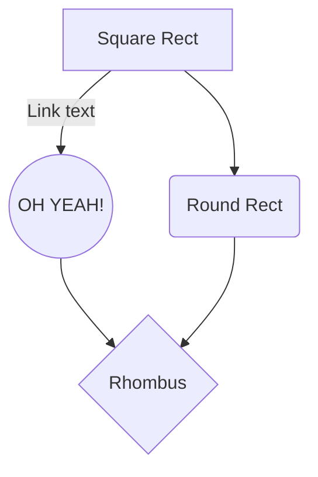

# C'est quoi
> Voir la documentaiont en ligne https://mermaid-js.github.io/mermaid/#/

# Mermaid

Mermaid est un outil JavaScript permettant de générer des images de diagrammes à partir d'une structure texte assez compréhensible.
Il permet de générer une image représentant le graphe des Facettes dans la représentation des Sphères. 

Documentation : https://mermaidjs.github.io/#/flowchart

Exemple :
```
    ```mermaid
    graph TD
      A[Square Rect] -- Link text --> B((Circle))
  	  A --> C(Round Rect)
      B --> D{Rhombus}
      C --> D
    ```
```



```mermaid
graph TD
  (Feu) --> (Métal)
  Métal --> (Ténèbres)
  Ténèbres --> (Poison)
  Poison --> (Pierre)
  Pierre --> Feu
  Ténèbres --> Feu
  Feu --> Poison
  Poison --> Métal
  Métal --> Pierre
  Pierre --> Ténèbres
```

# Récupérer le diagramme sous forme d'iamage

Utiliser l'éditeur en ligne : mermaid-js.github.io/mermaid-live-editor/
Copier/coller la définition de votre diagramme dans l'éditeur.
Cliquer sur "Download SVG" ou "Download PNG"