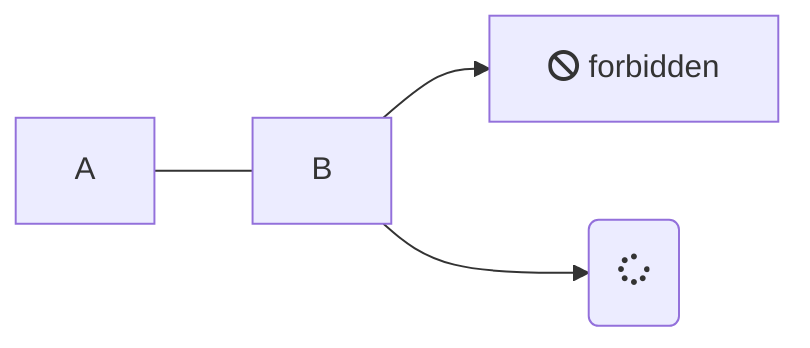

# C'est quoi
> Voir la documentaiont en ligne https://mermaid-js.github.io/mermaid/#/

# Mermaid

Mermaid est un outil JavaScript permettant de générer des images de diagrammes à partir d'une structure texte assez compréhensible.
Il permet de générer une image représentant le graphe des Facettes dans la représentation des Sphères. 

Documentation : https://mermaidjs.github.io/#/flowchart

Exemple :
```
    ```mermaid
    graph TD
      A[Square Rect] -- Link text --> B((Circle))
  	  A --> C(Round Rect)
      B --> D{Rhombus}
      C --> D
    ```
```


Avec des icones issues de [Font Awesome Icons](fontawesome.com/icons)

```
    ```mermaid
	  graph LR
      A --- B
      B-->C[fa:fa-ban forbidden]
      B-->D(fa:fa-spinner);
    ```
```

<link rel="stylesheet" href="https://use.fontawesome.com/releases/v5.13.0/css/all.css" crossorigin="anonymous">



Feu 🔥 
Métal ⚔️ ⚔🛡⚙️⚙
Ténèbres 🌑
Poison ☠️
Pierre🔨 🛠️ ⚒⛏ :rock💎: 🪨

<script>
mermaid.flowchartConfig = {
    width: 100%
}
</script>

```mermaid
graph TD
  Feu --> Métal(Métal)
  Métal --> Ténèbres(fa:fa-moon Ténèbres)
  Ténèbres --> Poison(fa:fa-skull-crossbones Poison)
  Poison --> Pierre(fa:fa-hammer Pierre)
  Pierre --> Feu(fa:fa-fire Feu)
  

  
  %%Ténèbres --> Feu
  %%Feu --> Poison
  %%Poison --> Métal
  %%Métal --> Pierre
  %%Pierre --> Ténèbres
```

  

# Récupérer le diagramme sous forme d'iamage

Utiliser l'éditeur en ligne : mermaid-js.github.io/mermaid-live-editor/
Copier/coller la définition de votre diagramme dans l'éditeur.
Cliquer sur "Download SVG" ou "Download PNG"