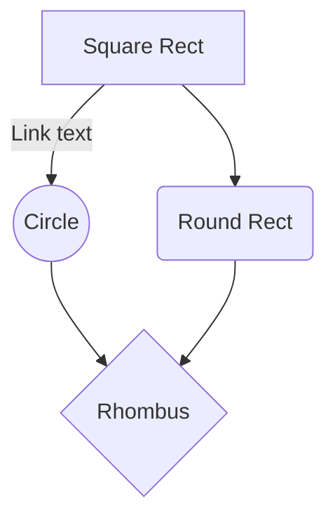

# C'est quoi
> Voir la documentaiont en ligne https://mermaid-js.github.io/mermaid/#/

graph LR
   a --> b & c--> d

```mermaid
graph TD
A[Square Rect] -- Link text --> B((Circle))
A --> C(Round Rect)
B --> D{Rhombus}
C --> D
```

Your content here