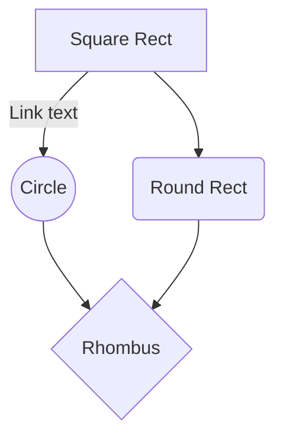

# C'est quoi
> Voir la documentaiont en ligne https://mermaid-js.github.io/mermaid/#/

# Mermaid

Mermaid est un outil JavaScript permettant de générer des images de diagrammes à partir d'une structure texte assez compréhensible.
Il permet de générer une image représentant le graphe des Facettes dans la représentation des Sphères. 

Documentation : https://mermaidjs.github.io/#/flowchart

Exemple :
```
    ```mermaid
    graph TD
      A[Square Rect] -- Link text --> B((Circle))
  	  A --> C(Round Rect)
      B --> D{Rhombus}
      C --> D
    ```
```

graph LR
   a --> b & c--> d





<div class="mermaid">
graph LR
    A --- B
    B-->C[fa:fa-ban forbidden]
    B-->D(fa:fa-spinner);
</div>
<script>mermaid.initialize({startOnLoad:true});</script>